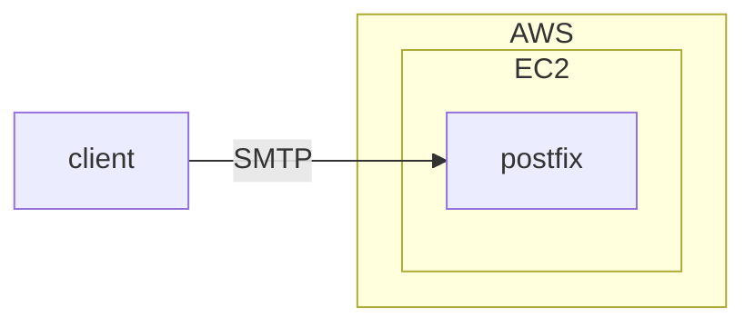
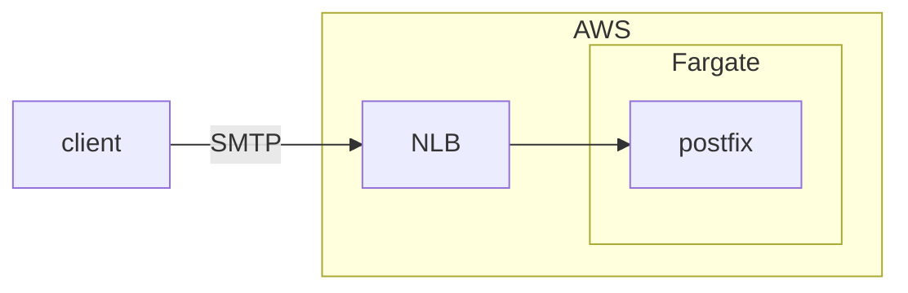

副業先で、EC2で動いているpostfixサーバをFargate移植することになったので記録しておきます。  
リレーサーバとしては使わず、メールを受信だけしてログを書いたら廃棄するという役割。  
副業先の上司がポチポチっと数分で作ったものです。



これをterraform化して、Fargateで動作させたい。

## Gitリポジトリを作る

とりあえずGitHubにリポジトリを作り、renovateを有効化します。  
次に、terraformバイナリのバージョン管理のため、aquaをinstall。

```shell
brew install aquaproj/aqua/aqua
```

何はなくともterraformをinstallします。

```Shell
aqua g -i hashicorp/terraform
aqua i
```

## CIを動かす準備

OIDCを設定して、CIをセキュアにします。  
アプリケーションやネットワークなどと関係ないものですので、settingsというtfstateを切ります。

```Shell
mkdir -p terraform/settings
cd terraform/settings
touch oidc.tf
```

OIDCの設定用にoidc.tfに書き、最初だけはローカルからplan/applyします。  
aws_iam_role、aws_iam_openid_connect_provider等ができたところで、GitHub ActionsでCIを動かすようにします。

```Shell
mkdir .github/workflows
cd .github/workflows
touch plan.yml
touch apply.yml
```

on.pull_requestでplanを実行、PRがマージされたらapplyします。
ついでに、plan結果をPRにコメントしてほしいので、tfcmtを入れます。
lintもしたいのでtflint、trivyを入れます。

```Shell
aqua g -i suzuki-shunsuke/tfcmt
aqua g -i terraform-linters/tflint
aqua g -i aquasecurity/trivy
touch lint.yml
```

lefthookでpre-commitフックでも実行するようにして、ローカル・リモートの双方でlintが走るようにします。

```Shell
aqua g -i evilmartians/lefthook
lefthook install
```

## terraform importする

tfstateの分割は、更新頻度が同じくらいのものをまとめるという方針にします。  
今回は前述のsettingsに加え、network、appの3つにします。  
(RDSなどがある場合はdatabaseを加えることが多いですが、今回は不要)

```Shell
mkdir -p terraform/network
cd terraform/network
touch main.tf
touch vpc.tf
touch subnet.tf
touch import.tf
```

import.tfにはimportブロックを書き、差分がでないところまでresourceのプロパティを書きます。  
importが終わったらimport.tfは削除します。  
ネットワークのあとは、EC2・Route53をimportします。

```Shell
mkdir -p terraform/app
cd terraform/app
touch main.tf
touch iam.tf
touch ec2.tf
touch route53.tf
touch import.tf
```

これで、既存のリソースのimportが終わりました。

## postfixをdockerで動かす

既存のpostfixからmain.cfをコピってきて、dockerで動くようにします。

```Shell
mkdir docker
touch Dockerfile
touch main.cf
touch entrypoint.sh
```

`docker run` で動かせるようになったら、ECRへpushできるようにします。

```Shell
mkdir -p terraform/app
cd terraform/app
touch ecr.tf
```

ECRができたら、CIへのpush用workflowを作ります。

```Shell
cd .github/workflows
touch deploy.yml
```

ECSへのデプロイにはecspressoを使います。  
terraformでのデプロイは流石に面倒なので..。  

```Shell
aqua g -i kayac/ecspresso
mkdir ecspresso
cd ecspresso
touch ecs-service-def.json
touch ecs-task-def.json
touch ecspresso.yml
```

## NLB + ECSを作る

SMTPを通したい・AutoScalingしたいので、NLBをECSの前に置きます。

```Shell
cd terraform/app
touch nlb.tf
touch ecs.tf
```

できあがった構成は↓こんな感じ。



実はNLBを作るのは初めてなので、動作確認をします。  
ECS Fargateが正常動作しているかはまだわからないので、とりあえずmin_capacity/max_capacityとも0にしておきます。  
NLBに既存のEC2をアタッチ、Route53に既存のAレコード（mail.example.com）とは別にNLB用のALIASレコードを追加します(new-mail.example.com)。  
(すぐ戻すのでterraform外で)  
GMailから<test@new-mail.example.com>にメールを送信、EC2上のpostfixのログを見て受信を確認します。  
うまくいったのでEC2をデタッチ。

次に、ECSサービスからFargateを起動して動作確認です。  

## 切り替え

Route53に再びALIASレコードを追加して、加重ルーティングを使用して既存10％/新90％で振り分けします。  
問題なく動作したので、50％/50％ -> 0％/100％という順序で加重を変更しました。  
無事に切り替えられたら、EC2を削除します。
