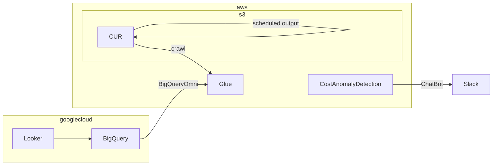

AWSでマルチアカウント運用しているとコスト管理がちょっとたいへんですよね。  
Cost Explorerでは単一アカウントしか見られないので、ほかのアカウントと比べて何にコストが掛かっているかみたいなのはグラフを並べて見られるとうれしい。  
一方で、毎日コストを見ているわけにもいかないので、異常時だけ通知してほしい。
ということで、こんな感じ。terraformで作ります。

## Cost Anomaly Detection

まずはコスト異常検出です。  
有効化するだけなのでそれほど面倒ではないのですが、AWS Chatbotがterraform対応してないので一工夫します。  
hashicorp/awsccを使うか、aws_cloudformation_stackリソースを使えばよいのですが、CURでCloudFormationテンプレートの読み込みをするので合わせます。

と、解説を書こうと思ったらクラメソさんがすでに書いているのでコレをそのまま使わせていただきます。  
いつもお世話になっています。多謝。  
[AWS Cost Anomaly Detection を Chatbot で Slack 通知させる by Terraform | DevelopersIO](https://dev.classmethod.jp/articles/cost-anomaly-detection-slack-terraform/)

## CUR

## BigQuery Omni

## Looker(Optional)
