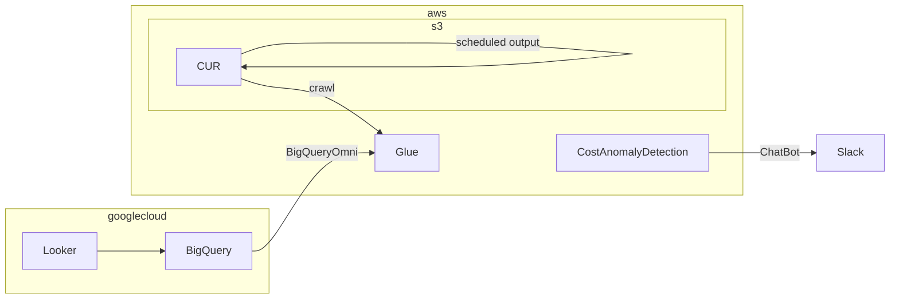

AWSでマルチアカウント運用しているとコスト管理がちょっとたいへんですよね。  
Cost Explorerでは単一アカウントしか見られないので、ほかのアカウントと比べて何にコストが掛かっているかみたいなのはグラフを並べて見られるとうれしい。  
一方で、毎日コストを見ているわけにもいかないので、異常時だけ通知してほしい。
ということで、こんな感じ。terraformで作ります。



## Cost Anomaly Detection

まずはコスト異常検出です。  
有効化するだけなのでそれほど面倒ではないのですが、AWS Chatbotがterraform対応してないので一工夫します。  
hashicorp/awsccを使うか、aws_cloudformation_stackリソースを使えばよいのですが、CURでCloudFormationテンプレートの読み込みをするので合わせます。

と、解説を書こうと思ったらクラメソさんがすでに書いているのでコレをそのまま使わせていただきます。  
いつもお世話になっています。多謝。  
[AWS Cost Anomaly Detection を Chatbot で Slack 通知させる by Terraform | DevelopersIO](https://dev.classmethod.jp/articles/cost-anomaly-detection-slack-terraform/)

## CUR

CURはus-east-1限定なのでご注意ください。  
CURを出力するS3バケットも同様です。  
BigQueryOmniからはAWS Glueに対してクエリを投げるので、Athena統合を指定します。  
S3のバケットポリシーも適切に設定する必要があります。  
マネジメントコンソールからCURを定義するとバケットポリシーを上書きしてくれるので、これをterraformに取り込んであげると簡単です。

```hcl
resource "aws_cur_report_definition" "example_cur_report_definition" {
  report_name                = "example-cur-report-definition"
  time_unit                  = "HOURLY"
  format                     = "Parquet"
  compression                = "Parquet"
  additional_schema_elements = ["RESOURCES", "SPLIT_COST_ALLOCATION_DATA"]
  s3_bucket                  = "example-bucket-name"
  s3_region                  = "us-east-1"
  additional_artifacts       = ["ATHENA"]
  report_versioning          = "OVERWRITE_REPORT
}
```

さて、これをapplyしても、S3にParquet形式で出力されるだけでAthenaでクエリできません。  
まずは、CURの出力を待つ必要があります。1日2回出力されるので、↑を実行して、ステータスがhealthyであることを確認したら翌日まで待ちましょう。

CURが出力されたら、[AWS CloudFormation テンプレートを使用した Athena のセットアップ - AWS コストと使用状況レポート](https://docs.aws.amazon.com/ja_jp/cur/latest/userguide/use-athena-cf.html)に記載の通り、CloudFormationテンプレートがCURと同じバケットに出力されるので、これを実行します。

```hcl
resource "aws_cloudformation_stack" "cfn-crawler" {

}
```

## BigQuery Omni

最後にBigQueryです。
