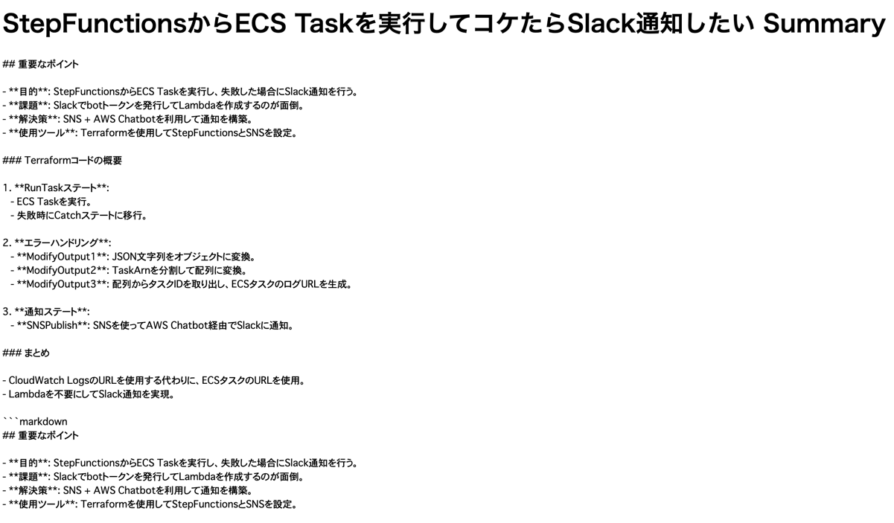
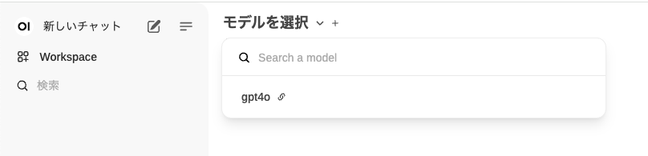

<!-- textlint-disable -->
「AIで開発生産性アップ的なことをしたいんだけどどうすっかねー？」  
「雑にChatGPT使って情報流出とか怖いし、社内用のAzure OpenAI Service呼んで...」  
みたいなフリが飛んできたので、やってみることにしました。
<!-- textlint-enable -->

## ブラウザで開いているページを要約する

全社Wikiのデータ引っこ抜いて学習させて、みたいなのは取っ掛かりとしてはデカすぎるので、小さく始めます。  
ということで、ブラウザで開いているページを要約してもらおうと考えました。  
Chrome extensionにしようかとも思ったんですが、野良extensionのinstallめんどいのでbookmarkletにします。

```Javascript
javascript:(()=>{
  const apiKey = "OPENAI_API_KEY";
  const url = 'https://example.openai.azure.com/openai/deployments/gpt4-o-model/chat/completions?api-version=2024-02-15-preview';
  const title = document.title;
  const contents = document.body.innerText;
  const data = {
    messages: [
      { role: 'system', content: 'You are an AI assistant that helps us. Please write Japanese.' },
      { role: 'user', content: `以下の文章を要約し、最も重要なポイントをMarkdownで示してください\n\nTitle: ${title}\nText: """\n${contents}\n"""`}
    ],
    max_tokens: 2000,
    temperature: 0.7,
    frequency_penalty: 0,
    presence_penalty: 0,
    top_p: 0.95,
    stop: null
  };

  fetch(url, {
    method: 'POST',
    headers: {
      'Content-Type': 'application/json',
      'api-key': apiKey
    },
    body: JSON.stringify(data)
  })
  .then(response => response.json())
  .then(result => {
    const summary = result.choices[0].message.content;
    const newWindow = window.open();
    newWindow.document.write(`<html><head><title>${title} Summary</title></head><body><h1>${title} Summary</h1><pre>${summary}</pre></body></html>`);
    newWindow.document.close();
  })
  .catch(error => {
    console.error('Error:', error);
    alert(`Error: ${error}`);
  });
})();
```

apiKeyとurlを書き換えて、bookmarkとして保存します。  
ブラウザで <https://zenn.dev/watarukura/articles/20240509-fqlkbjdnccw8lmcx1raljdwn3rmz0>
を開いて、bookmarkletを実行すると↓こんな感じ。  
(ポップアップブロックが動いちゃうので、お嫌いな方はconsole.logに流す方がいいかも)



## 社内で安心して使えるChatGPTを準備する

先輩から <https://github.com/open-webui/open-webui> を教えてもらったので、Azure OpenAI Serviceを呼ぶようにします。  
LiteLLMを使ってプロキシしてやればいい様子。
と、<https://zenn.dev/kun432/scraps/e1ff3ebfb97177#comment-5af53b5d8ff0dd> こちらを見れば大体書いてあります。

↓compose.ymlと、config.ymlを用意します。

```yaml
services:
  openai-proxy:
    image: ghcr.io/berriai/litellm:main-latest
    ports:
      - "8001:8000"
    volumes:
      - ./config.yml:/app/config.yml
    command: [ "--config", "/app/config.yml", "--port", "8000", "--num_workers", "8" ]
    environment:
      - "MASTER_KEY=${LITELLM_API_KEY}"
      - "OPENAI_API_KEY=${OPENAI_API_KEY}"
  open-webui:
    image: ghcr.io/open-webui/open-webui:${WEBUI_DOCKER_TAG-main}
    volumes:
      - open-webui:/app/backend/data
    ports:
      - ${OPEN_WEBUI_PORT-3000}:8080
    environment:
      - "OLLAMA_BASE_URL=http://ollama:11434"
      - "OPENAI_API_BASE_URL=http://openai-proxy:8000/v1"
      - "OPENAI_API_KEY=${LITELLM_API_KEY}"
    restart: unless-stopped
volumes:
  open-webui: { }
```

```yaml
# https://zenn.dev/link/comments/5af53b5d8ff0dd
model_list:
  - model_name: gpt4o
    litellm_params:
      api_base: https://example.openai.azure.com/
      model: azure/gpt4-o-model # "azure/[deployment_name]"
      api_key: "os.environ/OPENAI_API_KEY"
      api_version: "2024-02-15-preview"
litellm_settings:
  num_retries: 3
  request_timeout: 60
  timeout: 60
  set_verbose: True
general_settings:
  master_key: sk-1111
```

あとは、direnvでOPENAI_API_KEYを環境変数として読み込むようにして、`docker compose up`します。
ブラウザでlocalhost:3000を開けばOK。



## まとめ

とりあえず、短期間で動くものができたので満足です。
