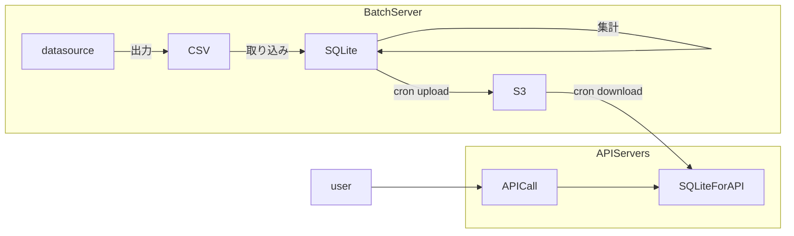

注意: 本記事に記載のシステムはもう存在しません。

昔々あるところに、RDBの利用が事実上禁止されていたシステムがありました。  
そのため、データストアの第一の選択肢はNoSQLです。DynamoDBを使用していました。  

ところで、そのシステムにはランキング表示機能がありました。  
商品カテゴリごとに販売数量を集計して、1位から順に表示する、よくある機能です。  
DynamoDBでコレを実装しようとすると、全件取ってきてデカいJSONを集計する必要があります。  
当然、現実的なレスポンスタイムは望めません。  
当該システムではどうしていたのでしょうか？  
そう、タイトルの通り、SQLiteを使用していました。脱法RDBです。

## アーキテクチャ

バッチサーバで、一定期間の販売実績をCSV出力してSQLiteへ取り込んでおきます。  
必要に応じて集計を行い、定期的にS3にアップロードします。  
APIサーバはAutoScalingするため、起動時および定期実行でS3からSQLiteファイルをダウンロードして最新のファイルに差し替えます。  
このSQLiteファイル、結構なファイルサイズがあって起動時のs3 syncに時間がかかり起動時間を遅くします。

s3 syncなどでファイルを移動させていたのですが、稀にSQLiteファイルが破損してしまいAPIサーバで開けない、みたいな事態になることもありました。  
`sqlite3 my.db "PRAGMA integrity_check";` を実行する、などで対策していましたが、batchサーバのCPUをかなり食ってしまい難儀した記憶があります。  

## 移行

さて、そんな脱法SQLiteですが、時流で隣のシステムがAurora MySQLを導入したため、コレを好機と移行することにしました。  
SQLite -> MySQLの変換ツール、Python製のなにかを使ったような...。  
APIサーバではO/Rマッパを使用しており、SQLiteからMySQLへの差し替えもそんなに難しくなかろうとやってみたのですが、性能が急激に悪化し一旦切り戻しました。  
よくよくコードを読むとn + 1が発生していました。  
SQLite利用時は、ネットワークアクセスが発生しないため十分早くレスポンスでき、問題にならなかったのです。  
そんなこともありながら、テーブル単位で徐々に移行し、年単位の時間を掛けてようやく移行を完了しました。  

## まとめ

Cloudflare D1の話を聞いたとき、「おお、あのときのアレに似たやつ」と思いました。  
更新は集中管理して参照だけのデータストアがほしいケースは、今もあるかもしれません。  
今思い出すと、マルチコネクション時のレスポンスとかどうだったんだろう、と疑問に思いますが、もう検証の必要もありませんし...。

セキュアなWordPress構築、では使えるかもしれません。  
<https://github.com/WordPress/sqlite-database-integration> はまだベータ版なので、腕力に自信のある方向けです。  
更新用の管理画面は隔離して、SQLiteファイルを参照用のWordPressに配布する、みたいな形です。  
何なら更新はローカルで実施して、SQLiteファイルS3にアップロードくらいでもいいかもです。  
もちろん、相応にアクセスがあるなら普通にMySQL使ったほうがいいですが。
