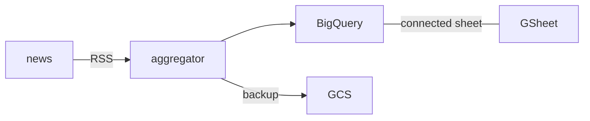
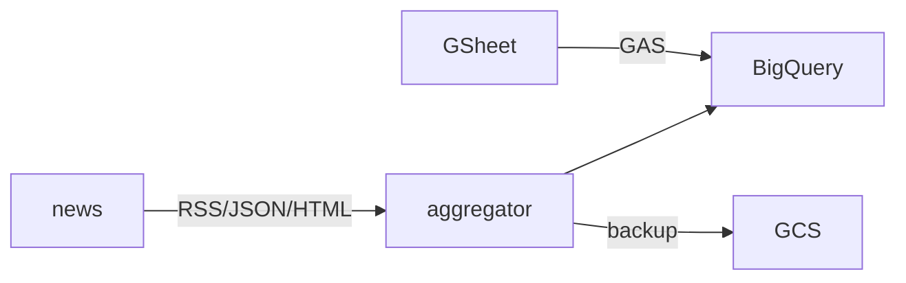

最近、業務外で構築したニュース収集システムのアーキテクチャについて説明します。

## 初期の要求

- ニュースソースからニュースを収集する
- 収集したニュースはBigQueryに格納する
- BigQueryに格納したニュース情報をGoogle Spreadsheet(以下、GSheet)で参照する

## 初期構築



まずは、RSSを取得するaggregatorをGitHub Actions上でBashスクリプトを使って構築しました。

1. 1時間おきにXMLをダウンロードし、yqコマンドでJSON Lines(以下、jsonl)に変換します。
    - <https://mikefarah.gitbook.io/yq/usage/xml>
    - `yq -p xml -o json <news.xml | jq -c '.|{title: .title, description: .description, (...)}'>news.jsonl`
2. DuckDBを使用してjsonlをParquetに変換します
3. BigQueryにParquetをロードします
    - BigQueryへアクセスするためのサービスアカウントおよびBigQueryスキーマをterraformで構築
    - DuckDBのBigQueryエクステンションを使って書き込みしようとしましたがうまくいかず、`bq load`しています
4. GCSにParquetをバックアップ用にアップロードします
5. GSheetからBigQueryのConnected Sheetsで参照します
   - <https://cloud.google.com/bigquery/docs/connected-sheets?hl=ja>

```shell
.
|-- .github        # GitHub Actions
`-- load.bash      # 実行用スクリプト
```

## 追加要求

- 単一のニュースソースではなく、複数のニュースソースからニュースを収集する

## 追加要件

- RSSが提供されている場合は、RSSから取得する
- APIが提供されている場合は、APIから取得する
- いずれも提供されていない場合は、HTMLからスクレイピングして取得する

## 追加構築



ニュースソースごとに取得方法が変わり、Bashスクリプトで条件分岐するのは辛いので、Pythonで書き直します。  
同じ形式のjsonlに変換すれば後続は修正不要なので、ニュースソースごとのjsonlに変換するmoduleを作ります。

BigQueryへのParquetのロード時に、aggregatorのコードに誤りがあって重複してロードされたレコードがありました。  
Google Apps Script(以下、GAS)を使用して、BigQueryにSQLを投げて重複削除して取得するようにします。  
(BigQueryはPrimary Key指定してもキー重複が発生しません)

GCSから直近3日アップロードしたバックアップParquetを取得し、取得したニュースと付き合わせることで重複して登録することを防ぎます。

GitHub ActionsからCloudRun Jobsへ移植するため、Docker化します。  
ArtifactRegistryへpushするGitHub Actionsを別途作成します。
Baseイメージはdistrolessとしました。Python11ベースなので、ここはいずれアップグレードが必要そうです。

```dockerfile
FROM ghcr.io/astral-sh/uv:0.6.9-python3.11-bookworm AS builder

WORKDIR /app
COPY --link . ./
ENV PYTHONUSERBASE=/app/__pypackages__
RUN uv export -o requirements.txt --no-hashes --no-dev && \
    python3 -m pip install --user --no-warn-script-location --no-cache-dir --requirement requirements.txt

FROM gcr.io/distroless/python3-debian12:nonroot

WORKDIR /app
COPY --chown=nonroot:nonroot --from=builder /app .
ENV PYTHONUSERBASE=/app/__pypackages__ \
    PYTHONDONTWRITEBYTECODE=1 \
    PYTHONUNBUFFERED=1 \
    PYTHONUTF8=1 \
    PYTHONIOENCODING="UTF-8" \
    PIP_NO_CACHE_DIR=off \
    PIP_DISABLE_PIP_VERSION_CHECK=on \
    PLATFORM=managed
USER nonroot
CMD ["./main.py"]
```

## 運用改善

- BigQueryをterraformでスキーマ管理する場合、スキーマを変更するとBigQueryテーブルを削除して作り直してしまう
    - alembicでのmigrationを行うように修正しました
    - [DBマイグレーションツールAlembicとBigQueryを連携して、マイグレーションを管理する](https://note.com/aaron_b/n/n13814b1df66e) こちらのブログを参考にさせていただきました
- GASのコンソールからコードを直接更新していたため、claspを使ってGitHubリポジトリへbackupするようにしました
- CloudRun Jobsのエラー時にSlack通知するようにCloudLoggingを設定しました
- WIP: [bigquery-emulator](https://github.com/goccy/bigquery-emulator)を使用して結合テストをmockで実行できるようにしたい
    - bigquery-emulatorへは`bq load`・`upload_from_filename(filename)`ができない様子
    - [fake-gcs-server](https://github.com/fsouza/fake-gcs-server)を使うことで、GCSからのアップロードで回避できないか検証中

現時点のディレクトリ構成は以下のとおりです。

```shell
.
|-- .github        # GitHub Actions
|-- docker         # Dockerfile
|-- docs           # ドキュメント
|-- lib            # ニュースソース単位の取得用module
|-- migrations     # DBスキーマ
|-- terraform      # terraformコード
`-- tests          # テストコード
```

## まとめ

DuckDBをデータエンジニアリングではなくアプリケーションで利用している事例なので、ちょっと珍しいかもしれないです。  
Parquetを簡単に扱えて便利ですね。
