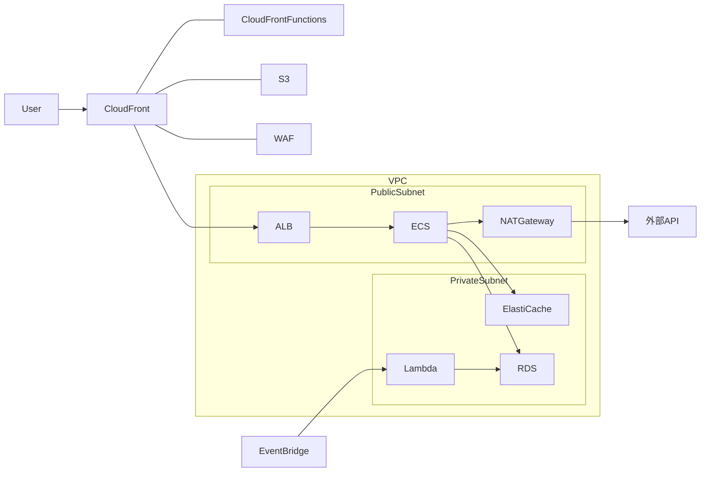

あるプロジェクトでは、IaCがなく、本番環境と開発環境が同居しているAWSアカウントから、開発環境を剥がして別アカウントに引っ越ししました。  
別のプロジェクトでは、AWS CDKで構築されており、やはり本番環境と開発環境が同居しているAWSアカウントから、本番環境と開発環境をそれぞれ別アカウントに引っ越ししています。  
様々な事情がありますが、それには触れず、何をどのようにしたかをまとめます。

## 対象アカウントの構成

いずれも、似たような構成でした。  



## 着手順

1. ドキュメントを書く
2. OIDCの設定
3. ネットワーク
4. RDS & ElastiCache
5. CloudFront & ALB
6. ECS & Lambda
7. その他

## ドキュメントを書く

GitHubリポジトリを作り、docsディレクトリを作ってその下にドキュメントを配置します。  
現状のAWSアーキテクチャ図をmermaidで書きます。  
この時点で、わかっていないこと・決めていないことがたくさんあるので、それもTODOリストとしてドキュメントに書きます。

## OIDCの設定

terraformを使い、plan / applyをGitHub Actionsで実施するため、OIDC用の設定を行います。  
OIDC用のIAM providerの作成はGitHub Actionsからは行えないので、ローカルからterraform applyを実行します。  
以後は原則としてGitHub Actionsからapplyします。  
Pull Request自体もドキュメントとして活用するためです。

## ネットワーク

引っ越し先のAWSアカウントにVPC・subnet等を作成します。  
既存アカウントのVPC CIDRや、AZ、NATGatewayの数などは特段の理由がなければ踏襲します。  
もちろん、開発環境のコスト削減のためにAZの数を減らしたいなどがあればこの時点で対応します。  
ネットワークについては、あえてterraform importすることもないかと思います。  

## RDS & ElastiCache

RDS & ElastiCacheについては、既存の設定を踏襲したいので、terraform importします。  
最初に、既存アカウントのAWSリソースからterraformコードを生成します。  
override.tfを作成して、引っ越し先アカウント用のtfstateを読み込まないようにします。

```hcl
terraform {
  backend "local" {
  }
}
```

次に、importブロックを書きます。  
(※ Terraform v1.5.0以降で使用可能な機能です)

```hcl
import {
  id = "old-rds-cluster-id"
  to = aws_rds_cluster.new
}
```

`terraform plan -generate-config-out=out.tf` を実行すると、importブロックに書かれたリソースがout.tfに書き出されます。  
あとは、プロジェクトのルールに従ってコードを配置します。  
生成されたコードではRDSにアタッチするセキュリティグループ等が文字列で指定されているので参照に書き直します。  
デフォルト値で設定されているものは削除してしまうと見通しが良くなります。

```diff
resource "aws_rds_cluster" "aurora" {
  # ...
-   vpc_security_group_ids = ["old-rds-security-group-id"]
+   vpc_security_group_ids = [aws_security_group.new_db.id]
  # ...
}

resource "aws_security_group" "new_db" {
  # ...
}
```

この時点で、既存アカウントへterraform planを実行して、差異が発生しないことを確認します。  

RDSのデータは、既存のDBからexportしてimportします。  
開発環境であれば既存のDBからmysqldump等で出力したSQLファイルを使ってリストアすれば良いです。  
本番環境の場合はサービスダウンタイムの許容やデータ量等で大きく難易度が異なってきます。  
ダウンタイム最小化したいのであれば、現・新の同期のためにAWS Database Migration Service(DMS)等を使用する必要があります。  
これはこれで大きな話なので、事例紹介にとどめておきます。  
[DMM.com が Amazon Aurora MySQL に移行して、最大 70% のパフォーマンス向上と運用コストの大幅削減を実現 | Amazon Web Services ブログ](https://aws.amazon.com/jp/blogs/news/migration-to-amazon-aurora-mysql-dmm-review/)

## CloudFront & ALB

CloudFrontを構築してしまうとサービスがインターネットに公開されてしまうので、AWS WAFをアタッチして公開先を制限します。  
ネットワーク設計を変更してよいのであれば、VPC Originを使用するのも良いでしょう。  
Lambda@Edge・CloudFront Functionsについては、更新頻度が低ければlambrollではなくterraformで管理します。  
なお、更新頻度が高い場合は、後述のLambdaと同様に管理しましょう。  
Lambda@Edge・CloudFront Functionsのソースコードは別ファイルで管理した方が書きやすいので、以下のようにします。

```sh
❯ tree --charset=C
.
`-- modules
    `-- cdn
        |-- files
        |   `-- function_name
        |       `-- index.js
        `-- cloudfront_function.tf
```

modules/cdn/cloudfront_function.tf で以下の様に指定します。  
index.jsの中身は既存のCloudFront Functionsのコードをコピー・アンド・ペーストすれば良いです。

```hcl
resource "aws_cloudfront_function" "function_name" {
  name    = "function_name"
  runtime = "cloudfront-js-2.0"
  publish = true

  code = file("${path.module}/files/function_name/index.js")
}
```

## ALB & ECS

ALB・ECR・ECSクラスターはterraformでimportして構築します。  
ECSサービス・ECSタスク定義等はecspressoを使って定義します。  
<!-- textlint-disable -->
`ecspresso init --service=<ecs service name> --cluster=<ecs cluster name>`  
<!-- textlint-enable -->
スケジュール実行するタスクがある場合は、ecspressoで一度ECSサービスをdeployをして、ECSタスク定義を作ってからdata sourceとして参照します。  
GitHub Actionsでdocker/build-push-actionを使ってdocker buildし、ECRへpush、ecspresso deployします。

```yaml
name: Deploy
on:
  workflow_dispatch:
concurrency:
  group: ${{ github.workflow }}-${{ github.ref }}
  cancel-in-progress: true
env:
  ECR_URI: <account id>.dkr.ecr.ap-northeast-1.amazonaws.com/<image name>
jobs:
  deploy:
    name: Deploy
    runs-on: ubuntu-latest
    timeout-minutes: 30
    permissions:
      id-token: write
      contents: read
      pull-requests: write
      issues: write
    steps:
      - name: Checkout
        uses: actions/checkout@6
        with:
          persist-credentials: false
      - name: Set up AWS credentials
        uses: aws-actions/configure-aws-credentials@v5
        with:
          role-to-assume: ${{ vars.AWS_ROLE_ARN }}
          aws-region: ap-northeast-1
      - name: Login to Amazon ECR
        id: login-ecr
        uses: aws-actions/amazon-ecr-login@v2
      - name: Set up QEMU
        uses: docker/setup-qemu-action@v3
      - name: Set up Docker Buildx
        id: setup-buildx
        uses: docker/setup-buildx-action@v3
      - name: Build and push
        uses: docker/build-push-action@v6
        with:
          context: .
          push: true
          platforms: linux/arm64
          tags: |
            ${{ env.ECR_URI }}:${{ github.sha }}
          provenance: false
          cache-from: type=gha
          cache-to: type=gha,mode=max
      - uses: aquaproj/aqua-installer@v4
        with:
          aqua_version: v2.55.1
      - name: ecspresso deploy
        working-directory: ecspresso/stg
        shell: bash
        run: |
          GITHUB_SHA=${{ github.sha }} ecspresso deploy --no-wait
```

Lambda用のIAMロールやトリガーとなるイベント(EventBridge Schedulerなど)はterraformで管理します。  
そのうえで、Lambdaのソースコードのimportはlambrollで行います。  
`lambroll init --function-name=<lambda function name>`  
こちらも、GitHub Actionsでdeployするworkflowを書きます。  
LambdaのRuntimeによって`npm install`や`go build`が必要になると思いますので、ココでは割愛します。  
元のCPUアーキテクチャがx86_64なのであれば、arm64に変更して、コスト削減しても良いでしょう。

## その他

あとは、アプリケーションが動くようになるまで、必要なAWSリソースを整備します。  
シークレット周りはtfstateへの値の混入（漏洩リスク）を防ぐため、terraform管理外とします。
parameter store / secrets managerは手動で登録します。  
コンソール・AWS CLIのいずれか好みの方法で登録するのが良いでしょう。  

(この辺りも、[1password Environments](https://developer.1password.com/docs/environments/)と[Ephemeral values](https://developer.hashicorp.com/terraform/language/manage-sensitive-data/ephemeral)を組み合わせればterraform管理できるかも...?)

## まとめ

CDKを触ったことがなかったのでterraform化しましたが、CDKのコードを活かす選択肢も期限やチームや会社の技術スタックによっては全然アリです。  
CDKのコードをCursorに読ませて作成されるAWSリソースの洗い出しをして、ヌケモレなくimportできているかチェックしたりもしました。
<!-- textlint-disable -->
既存のdeploy用GitHub Actionsのコードでは、buildしてcdk deployだけで「docker build -> ECRへpush -> ECSサービスをupdate」まで実施していて羨ましく思いました。
<!-- textlint-enable -->
