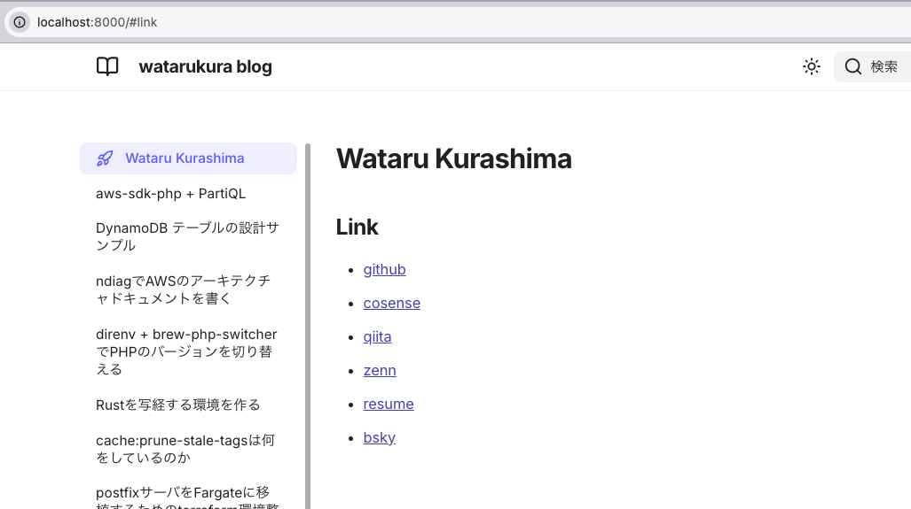

zenn.devとcosense(旧scrapbox)を使用しているのですが、いざというときとのためにbackupが欲しいなと唐突に思いました。  
markdownファイルをいい感じにGitHub Pagesで公開できるようにしたい、と思って調べていたところ、[Zensical](https://zensical.org/docs/get-started/)というツールを見つけたので、使ってみることにします。

## Zensical

[Material for MkDocs](https://squidfunk.github.io/mkdocs-material/)の開発チームが作ったRust製の静的サイトジェネレータです。

## 出来上がったもの

- [zenn-content](https://watarukura.github.io/zenn-content/)
  - [GitHub repo](https://github.com/watarukura/zenn-content/)
- [cosense-content](https://watarukura.github.io/cosense-content/)
  - [GitHub repo](https://github.com/watarukura/cosense-content/)

## zenn-content

```shell
uv add zensical
uv zensical new .
```

あとは、zensical.tomlのproject情報を書き、project.themeのcustom_dirを"article"に変更しました。  
articles/index.md に適当な見出しページを作って、`uv run zensical serve` すると、localhost:8000 でプレビューできます。



GitHub Pagesで公開する方法もZensicalのドキュメントにサンプルがあります。  
<https://zensical.org/docs/publish-your-site/>
これで、mainブランチにpushしたら公開できる仕組みの出来上がりです。

## cosense-content

cosenseの方は一旦markdownに変換する必要があります。  
Pythonで変換用のコードを公開している方がいらしたので、ありがたく使わせていただきました。  
<https://github.com/matsushinDB11/Scrapbox_to_md/blob/master/Scrapbox_to_Notion.py>

indentが2だとzensicalがレベル判定してくれないので4にしたり、全角スペースもindentにしたりといった軽い修正を加えていますが、ほとんどそのまま利用でき、大変助かりました。  

定期的にcosenseの記事をダウンロードしたいので、日付指定でcosenseの内部APIを呼んでダウンロードします。  
<https://scrapbox.io/help-jp/API>
>あくまで内部APIです。APIは予告なく変更を行います。
とのことなので、変更されたら追随しないとですね。
シェルスクリプトをざっと書いて、Codexに相談してコマンドラインオプション周りの機能を追加してもらいました。

```shell
#!/usr/bin/env bash
set -euo pipefail
set -xv

PROJECT="watarukura"

usage() {
  echo "Usage: $0 [-d YYYY-MM-DD|--since YYYY-MM-DD] [--skip-download]" >&2
  exit 2
}

since_date=""
skip_download=0
while [[ $# -gt 0 ]]; do
  case "$1" in
    -d|--since)
      [[ $# -ge 2 ]] || usage
      since_date="$2"
      shift 2
      ;;
    --since=*)
      since_date="${1#*=}"
      shift
      ;;
    -h|--help)
      usage
      ;;
    --skip-download)
      skip_download=1
      shift
      ;;
    *)
      echo "Unknown option: $1" >&2
      usage
      ;;
  esac
done

since_epoch=""
if [[ -n "$since_date" ]]; then
  if date -j -f "%Y-%m-%d" "$since_date" "+%s" >/dev/null 2>&1; then
    since_epoch=$(date -j -f "%Y-%m-%d" "$since_date" "+%s")
  else
    since_epoch=$(date -d "$since_date" "+%s")
  fi
fi

title_filter='.pages[].title'
jq_args=()
if [[ -n "$since_epoch" ]]; then
  title_filter='.pages[] | select(.updated >= $since_epoch) | .title'
  jq_args=(--argjson since_epoch "$since_epoch")
fi

page=1
if [[ "$skip_download" -eq 0 ]]; then
  curl -sL "https://scrapbox.io/api/pages/$PROJECT?sort=updated" >"articles$page"
  count=$(jq -r .count "articles$page")
  limit=$(jq -r .limit "articles$page")
  if [[ "$count" == "null" || "$limit" == "null" ]]; then
    echo "Failed to read page metadata from scrapbox API." >&2
    exit 1
  fi
  while ((count > limit)); do
    count=$((count - limit))
    skip=$((page * limit))
    page=$((page + 1))
    curl -sL "https://scrapbox.io/api/pages/$PROJECT?sort=updated&skip=$skip" >"articles$page"
  done
fi

if [[ "$skip_download" -eq 0 ]]; then
  mkdir -p scrapbox
  cat articles* |
    jq -r "${jq_args[@]}" "$title_filter" |
    sed -e 's;/;%2F;g' -e 's/ /_/g' |
    while read -r title; do
      curl -sL "https://scrapbox.io/api/pages/$PROJECT/$title/text" >"scrapbox/$title".sb
    done
fi

mkdir -p markdown
cat articles* |
  jq -r "${jq_args[@]}" "$title_filter" |
  sed -e 's;/;%2F;g' -e 's/ /_/g' |
  while read -r title; do
    uv run sb2md.py "scrapbox/$title".sb >"markdown/$title".md
  done
```

で、このスクリプトを週次で実行して、Pull Requestを作るGitHub Actionsのworkflowを作ります。
週1回、直近1週間の更新分を取ってきて、Pull Requestを作ります。  
マージしたら公開される、という仕組みです。

```yaml
name: Weekly Cosense Update PR
on:
  schedule:
    - cron: "0 0 * * 2"
  workflow_dispatch:
permissions:
  contents: write
  pull-requests: write
jobs:
  update:
    runs-on: ubuntu-latest
    steps:
      - uses: actions/checkout@de0fac2e4500dabe0009e67214ff5f5447ce83dd # v6.0.2
        with:
          persist-credentials: false
      - uses: actions/setup-python@a309ff8b426b58ec0e2a45f0f869d46889d02405 # v6.2.0
        with:
          python-version: "3.13"
      - uses: astral-sh/setup-uv@61cb8a9741eeb8a550a1b8544337180c0fc8476b # v7.2.0
      - name: Fetch updated Cosense pages
        env:
          TZ: Asia/Tokyo
        run: |
          since_date=$(date -d "7 days ago" +%Y-%m-%d)
          bash scripts/download_cosense.bash --since "$since_date"
      - name: Create pull request
        uses: peter-evans/create-pull-request@c0f553fe549906ede9cf27b5156039d195d2ece0 # v8.1.0
        with:
          commit-message: "Update Cosense content (weekly)"
          title: "Update Cosense content (weekly)"
          body: |
            Automated weekly update for Cosense content.
          branch: "automation/weekly-cosense-update"
          delete-branch: true
```

## まとめ

仕組みとしては難しいものではないのですが、自分のテックブログを持つことの安心感はありますね。  
デザインがデフォルトのままだったり、オンラインドキュメントっぽいつくりなのでブログっぽくしたい、などやりたいことはあるので盆栽していこうと思います。
