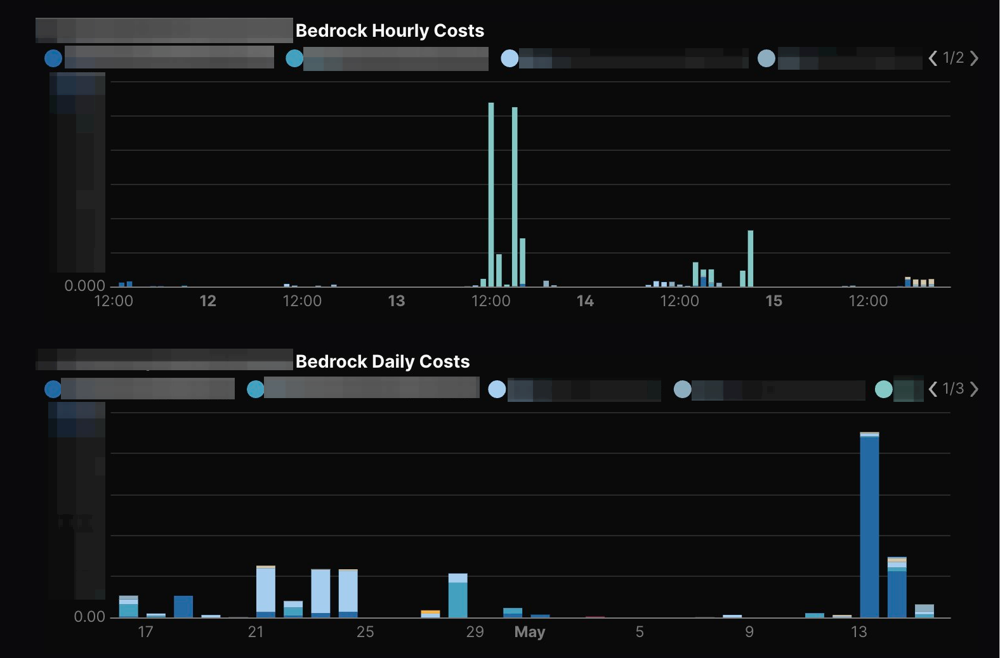

<!-- textlint-disable -->
[IAM プリンシパルベースのコスト配分で Amazon Bedrock のコストを呼び出し元ごとに追跡する | Amazon Web Services ブログ](https://aws.amazon.com/jp/blogs/news/track-amazon-bedrock-costs-by-caller-identity-with-iam-based-cost-allocation/)
<!-- textlint-enable -->
Amazon Bedrock のコストを呼び出し元ごとに追跡できる、IAM プリンシパルベースのコスト配分が利用できるようになりました。  
これにより、Bedrock の利用コストを利用者別に集計しやすくなります。  
ということで、Terraformでの実装も含めて紹介します。

## 前提

- IAM Identity Centerを設定してSSOログインを有効化済みであること
    - IAMユーザ・IAMロールを使用している場合は↑のAWSの記事を参考に、コスト配分タグを設定する必要があります

## CUR2.0を設定する

CUR2.0および出力先のS3バケットはus-east-1に作成する必要があるので注意してください。  
また、S3バケットの作成についての記述は省略しています。

```hcl
resource "aws_bcmdataexports_export" "cur" {
  export {
    name = "cur2_0"
    data_query {
      query_statement = "SELECT line_item_unblended_cost, line_item_usage_start_date, product, line_item_iam_principal FROM COST_AND_USAGE_REPORT"
      table_configurations = {
        COST_AND_USAGE_REPORT = {
          BILLING_VIEW_ARN                      = "arn:aws:billing::${data.aws_caller_identity.self.account_id}:billingview/primary"
          INCLUDE_IAM_PRINCIPAL_DATA            = "TRUE"
          INCLUDE_CAPACITY_RESERVATION_DATA     = "FALSE"
          INCLUDE_MANUAL_DISCOUNT_COMPATIBILITY = "FALSE"
          INCLUDE_RESOURCES                     = "FALSE"
          INCLUDE_SPLIT_COST_ALLOCATION_DATA    = "FALSE"
          TIME_GRANULARITY                      = "HOURLY"
        }
      }
    }
    destination_configurations {
      s3_destination {
        s3_bucket = aws_s3_bucket.cur.bucket
        s3_prefix = "cur2_0"
        s3_region = "us-east-1"
        s3_output_configurations {
          compression = "PARQUET"
          format      = "PARQUET"
          output_type = "CUSTOM"
          overwrite   = "OVERWRITE_REPORT"
        }
      }
    }
    refresh_cadence {
      frequency = "SYNCHRONOUS"
    }
  }
}
```

上記を設定すると、CUR2.0が有効になり、us-east-1のS3バケットにデータが定期的に出力されます。  
日次でParquetファイルを上書き出力、100以上あるカラムから必要なものだけに絞っています。  
`INCLUDE_IAM_PRINCIPAL_DATA` が重要です。これを`"TRUE"`に指定することで、IAMプリンシパルベースの集計ができるようになるため。  
初回出力は最大24時間かかる場合があるので、作成したら翌日まで待ってください。

## duckdbで集計する

line_item_iam_principalから、メールアドレスだけ取り出したいので `split()` を使用しています。  
WHERE句の箇所でClaudeの利用のみに絞っていますが、Claude以外のモデルを使用している場合は修正してください。

```sql
❯ aws-vault exec example-aws.ReadonlyAccess --region=us-east-1 -- duckdb              
Opening the SSO authorization page in your default browser (use Ctrl-C to abort)
DuckDB v1.5.2 (Variegata)
Enter ".help" for usage hints.
memory D INSTALL httpfs;
memory D LOAD httpfs;
memory D CREATE OR REPLACE TABLE cur_bedrock AS
         SELECT line_item_usage_start_date,
                COALESCE(
                        split(line_item_iam_principal, '/')[-1],
                        'unknown'
                ) AS user,
                SUM(line_item_unblended_cost) AS cost
         FROM read_parquet("s3://${S3_BUCKET}/**/cur2_0*.parquet")
         WHERE product.product_name LIKE 'Claude%'
         GROUP BY 1, 2
         HAVING SUM(line_item_unblended_cost) > 0.0
         ORDER BY 1, 2;

┌────────────────────────────┬──────────────────────────────┬─────────────────────┐
│ line_item_usage_start_date │             user             │        cost         │
│         timestamp          │           varchar            │       double        │
├────────────────────────────┼──────────────────────────────┼─────────────────────┤
│ 2026-04-01 03:00:00        │ unknown                      │          0.11111111 │
│ 2026-04-01 07:00:00        │ unknown                      │          0.44444444 │
│ 2026-04-01 08:00:00        │ unknown                      │         0.777777777 │
│          ·                 │    ·                         │           ·         │
│          ·                 │    ·                         │           ·         │
│          ·                 │    ·                         │           ·         │
│ 2026-05-15 10:00:00        │ hoge@example.jp              │         0.555555555 │
│ 2026-05-15 11:00:00        │ fuga@example.jp              │          1.11111111 │
│ 2026-05-15 11:00:00        │ piyo@example.jp              │          0.77777777 │
└────────────────────────────┴──────────────────────────────┴─────────────────────┘
```

2026-04-08からIAMプリンシパルの機能が有効になったため、それ以前のデータは利用者が`unknown`になります。

## evidence-dev/evidenceでダッシュボードを作成する

[CURをduckdbでクエリしてevidenceでチャートにする](https://zenn.dev/watarukura/articles/20241222-irbvxucfjw32kvpkh9eil6canjslxs)
設定方法は↑上の記事で書きました。

↑で作成したcur_bedrockテーブルを直近1か月分に絞って使用します。

```sql
SELECT line_item_usage_start_date,
       user,
       SUM(cost) AS cost
FROM cur_bedrock
WHERE line_item_usage_start_date >= CURRENT_DATE () - INTERVAL 1 MONTH
GROUP BY 1, 2;
```



## まとめ

これで、誰が・いつ・いくら分、Bedrockを使用したか可視化できるようになりました！  
必要ならどのモデルが多く呼ばれているかも集計してもよいですし、  
DuckDBのクエリ結果をJSON出力してLLMに読み込ませてレポートを作成、とかもできますね。
